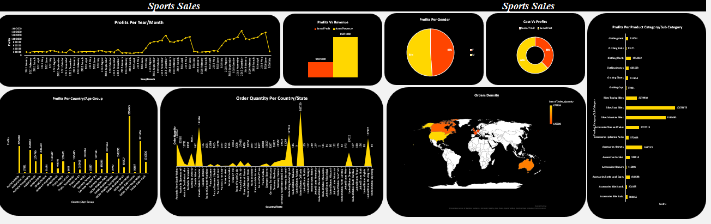

### Sales Analysis & Visualization Dashboard - Excel Project

### Overview

This dashboard visualizes sports sales data, including profits, order quantities, and cost breakdowns across various dimensions such as year/month, country, gender, age group, and product categories.

### Sections

-**Profits Per Year/Month**: Line chart showing profit trends over time.

-**Profits vs Revenue**: Bar chart comparing profits and revenue.

-**Profits Per Gender**: Pie chart displaying profit distribution by gender.

-**Cost vs Profits**: Donut chart illustrating cost and profit allocation.

-**Profits Per Product Category/Subcategory**: Bar chart detailing profits by product type.

-**Profits Per Country/Age Group**: Bar chart showing profit distribution by country and age group.

-**Order Quantity Per Country/State**: Bar chart indicating order volumes by location.

-**Orders Density**: World map highlighting order density by region.

### Tools Used

-**Excel**: Used for initial data entry and basic calculations.

-**Power Query**: Employed for data cleaning, transformation, and preparation.

-**Pivot Table**: Utilized for summarizing and analyzing data to create the dashboard visuals.

